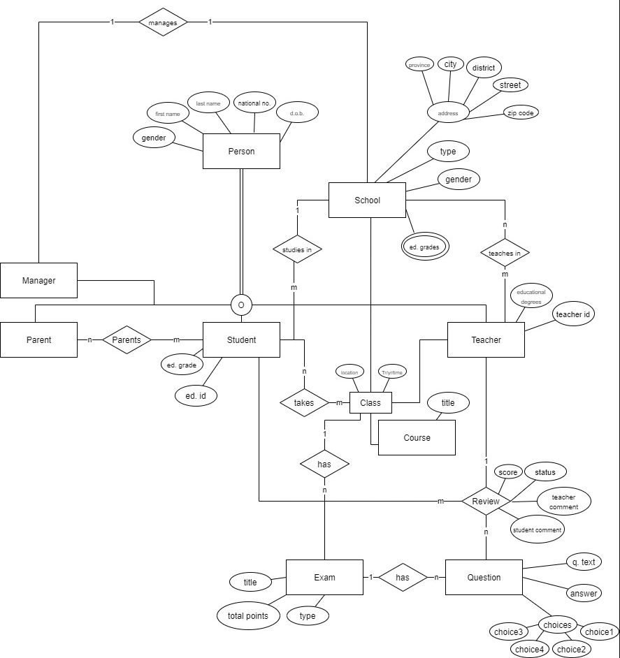

# Gradescores
API implementation for [Gradescores](http://gradescores.com/) system to evaluate students, written in python and powered by [Django Rest Framework](https://www.django-rest-framework.org/)


## Features
- Register Teachers
- Register Students
- Register Parents and set their children
- Register Schools
- Parents can observe their children exam-evaluations
- Teachers can create questions
- Teachers can create exams by choosing a set of already created questions
- Students can submit their answers to their question
- After each submission review (by teachers) student's exam evaluation updates automatically (trigger)
- Set school for students
- create classes by choosing list of students

## Prerequisites
- postgresql
- python3
- django
- djangorestframework


## Getting Started
1. Create a database named `gradescores` and create a user with full access to it and enter required info in gradescores/settings.py:
```
DATABASES = {
    'default': {
        'ENGINE': 'django.db.backends.postgresql',
        'NAME': 'gradescores',
        'USER': 'gradescoresuser',
        'PASSWORD': '123',
        'HOST': 'localhost',
        'PORT': '',
    }
}
```
2. Enter commands below
```bash
sudo apt install postgresql virtualenv
cd pg-gradescores/api
virtualenv -p python3.9 venv
source venv/bin/activate
pip3 install -r requirements.txt
python3 manage.py makemigrations
python3 manage.py migrate
python3 manage.py runserver
```
3. Open `localhost:8000/swagger` on your browser to see documentation (a preview is saved as `swagger_preview.pdf` under `assets` directory)

### Some techincalities:
- pgadmin view and dynamic exam evaluation trigger

```sql
declare
		total int;
	BEGIN
		delete from main_examevaluation where exam_id = old.exam_id;
		select sum(main_submission.points) from main_submission where main_submission.student_id = old.student_id and main_submission.exam_id = old.exam_id into total;
		insert into main_examevaluation(points,exam_id,student_id) values(total,old.exam_id,old.student_id);
		return new;
	END;

```
- ERD:

- Tables:
[tables markdown file](assets/tables.md)

- Table definitions:
[sql file](assets/location.sql)
- Some sample queries:
[sql queries](assets/init.sql)
- Code snippet
```python
class TeacherViewset(viewsets.ModelViewSet):
    queryset = Teacher.objects.all()
    serializer_class = TeacherSerializer

    @action(detail=True, url_path='exams')
    def get_exams(self, request, *args, **kwargs):
        queryset = Exam.objects.raw("select * from main_exam join  main_class on main_exam.corresponding_class_id=main_class.id where teacher_id = {};".format(self.get_object().personal.id))
        serializer = ExamSerializer(queryset, many=True)
        return Response(data=serializer.data)
```
